# Deep Learning - Multiple Projects

## Introduction

This repository contains multiple projects from the course "Deep Learning" at Leiden University. The projects are implemented in Python using TensorFlow and Keras or in a few cases the neural network was implemented from scratch. The projects are divided into the following categories:
1. **Data Dimensionality - Distance Based Classification**
2. **MultiClass Perceptron**
3. **XOR Network - Gradient Descent**
4. **Fashion MNIST & CIFAR-10 - TensorFlow**
5. **"Tell The Time" Network**
6. **Generative Models - Autoencoders (VAEs) & Generative Adversarial Networks (GANs)**

## Files

The repository contains the following files:
- `Classifier.ipynb`: Jupyter notebook containing the implementation of a distance-based classifier.
- `Perceptron.ipynb`: Jupyter notebook containing the implementation of a multi-class perceptron.
- `XOR.ipynb`: Jupyter notebook containing the implementation of a neural network to solve the XOR problem using gradient descent.
- `MNIST.ipynb`: Jupyter notebook containing the implementation of a neural network to classify the Fashion MNIST and CIFAR-10 datasets.
- `Time.ipynb`: Jupyter notebook containing the implementation of a neural network to tell the time.
- `Generative.ipynb`: Jupyter notebook containing the implementation of VAES and GANs.
- `data/`: Folder containing the datasets used in the projects.
- `plots/`: Folder containing the plots generated in the projects.
- `report_1.pdf`: Report for the first assignment (projects 1-3).
- `report_2.pdf`: Report for the second assignment (projects 4-6).
- `README.md`: This file.

## Running the Code

To run the code, you will need to run the Jupyter notebooks in the repository. In each notebook, there are several imports that need to be installed. All of them are in the first cell of the notebook, so you can check which ones you need to install. You can install them using the following command:

```bash
pip install <package_name>
```

For each project, there is a corresponding Jupyter notebook that you can run. The notebooks contain the implementation of the neural networks and the results of the experiments. The notebooks are self-contained and contain all the necessary information to run the code. 

## Datasets

The datasets used in the projects are in the `data/` folder. In some cases, the datasets are loaded directly from the TensorFlow library, so you do not need to download them separately. In other cases, you will need to download the datasets from the links provided in the notebooks (there is a cell with the code to download the dataset in each notebook if needed).

## Results

### Data Dimensionality - Distance Based Classification

The first project was about implementing a distance-based classifier on the classic MNIST dataset, which contains images of handwritten digits. 

First we applied three different dimensionality reduction techniques:
- Principal Component Analysis (PCA)
- t-Distributed Stochastic Neighbor Embedding (t-SNE)
- Uniform Manifold Approximation and Projection (UMAP)

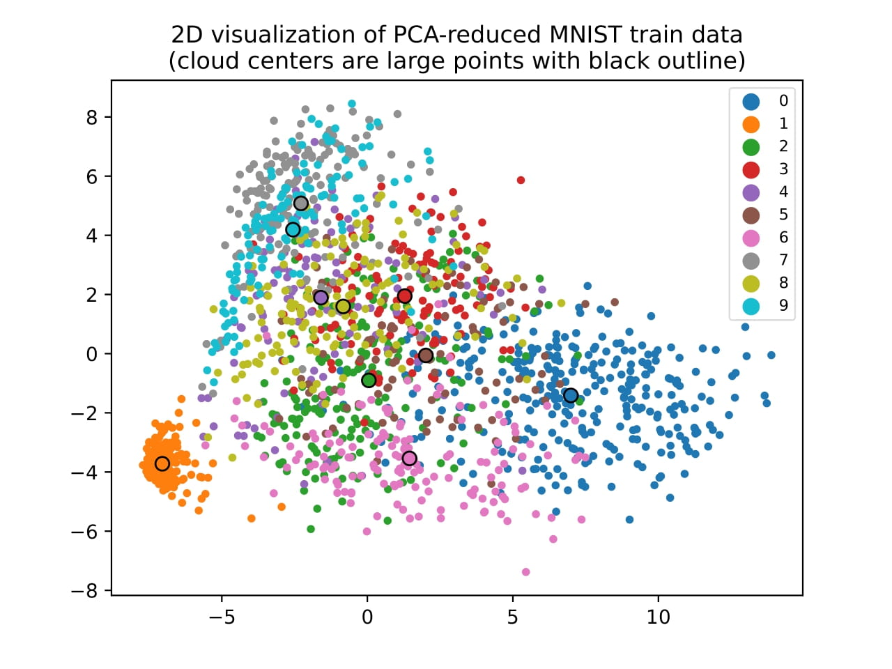
*Principal Component Analysis (PCA)*

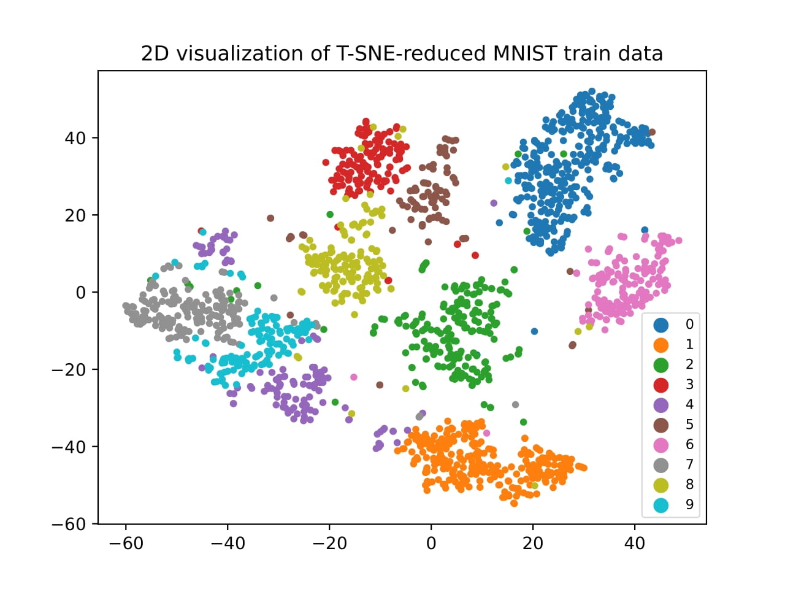
*t-Distributed Stochastic Neighbor Embedding (t-SNE)*

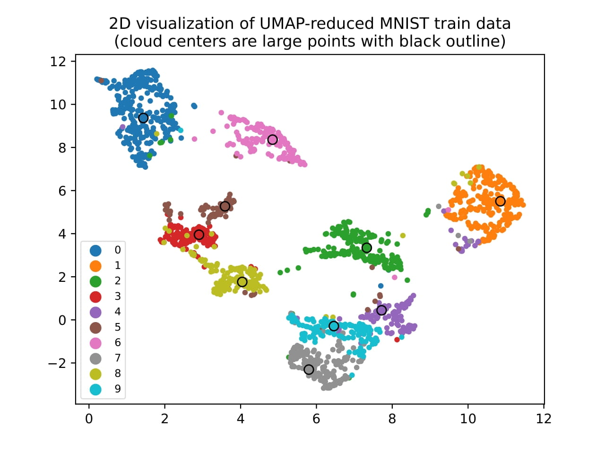
*Uniform Manifold Approximation and Projection (UMAP)*

We also implemented two classification algorithms to the reduced data:
- a simple distance-based classifier
- a k-Nearest Neighbors (k-NN) classifier

The results are shown in the table below:

| Classifier | Dataset | Correct | Incorrect | Accuracy |
|------------|---------|---------|-----------|----------|
| Distance   | Train   | 1474    | 233       | 86.35%   |
|            | Test    | 804     | 196       | 80.40%   |
| k-NN       | Train   | 1671    | 36        | 97.89%   |
|            | Test    | 914     | 86        | 91.40%   |

We can see that the k-NN classifier performed better than the distance-based classifier.

### MultiClass Perceptron

The second project was about implementing a multi-class perceptron on the classic MNIST dataset. We implemented the perceptron <ins>from scratch</ins> and trained it on the MNIST dataset. We used two different training methods:
- Batch training (updating the weights after each epoch)
- Online training (updating the weights after each sample)

The figure below shows the accuracy of the perceptron on the training and test sets during training

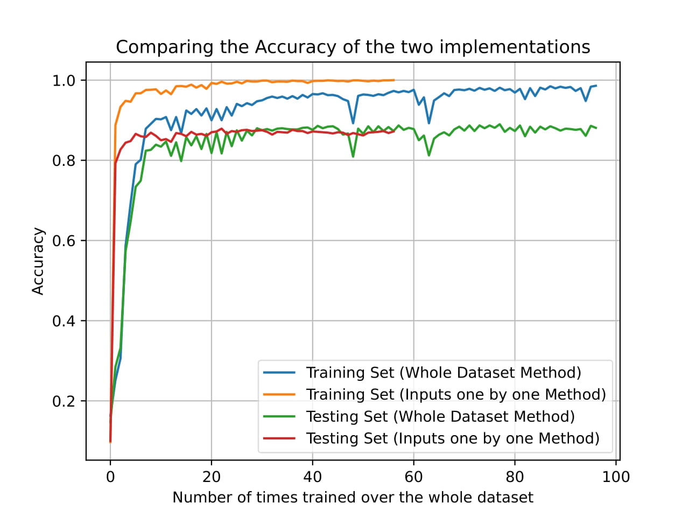
*Accuracy of the perceptron on the training and test sets during training*

The final accuracy results are shown in the table below:

| Method | Dataset | Correct | Incorrect | Accuracy |
|--------|---------|---------|-----------|----------|
| Batch  | Train   | 1683    | 24        | 98.59%   |
|        | Test    | 881     | 119       | 88.10%   |
| Online | Train   | 1707    | 0         | 100.00%  |
|        | Test    | 872     | 128       | 87.20%   |

We can see that the online training method performed better on the training set, but the batch training method performed better on the test set. This is because the online training method overfits the training data.

### XOR Network - Gradient Descent

We implemented a simple neural network <ins>from scratch</ins> to solve the XOR problem using gradient descent. The network had the following architecture:
- Input layer with 3 units (2 input features + bias)
- Hidden layer with 2 units
- Output layer with 1 unit (binary output)

We also implemented the backpropagation algorithm and error function (mean squared error) to train the network using gradient descent <ins>from scratch</ins>. We trained the network on the XOR dataset:
- (0, 0) -> 0
- (0, 1) -> 1
- (1, 0) -> 1
- (1, 1) -> 0

The figures below show the loss (mean squared error) during training for different learning rates and different initializations of the weights. For the initializations, we used random values between -1 and 1, sampled from either a uniform or normal distribution.

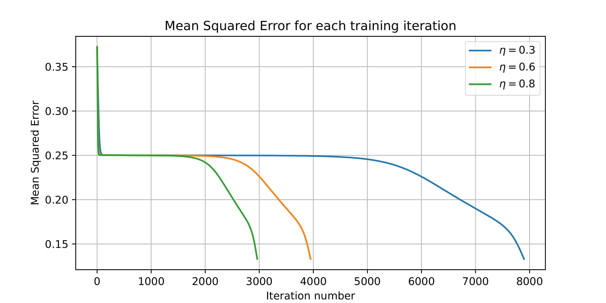
*Loss during training for different learning rates*

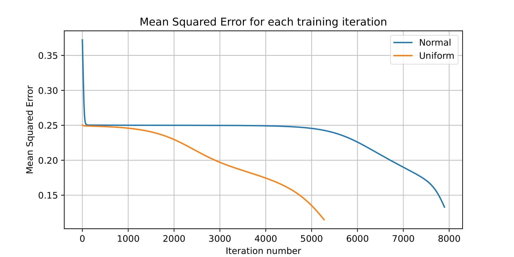
*Loss during training for different initializations of the weights*

We can see that the network was able to learn the XOR function using gradient descent in all cases. The best performance was achieved with a learning rate of 0.8 and random initialization of the weights from a uniform distribution.

### Fashion MNIST & CIFAR-10 - TensorFlow

We implemented a neural network using TensorFlow and Keras to classify the Fashion MNIST and CIFAR-10 datasets. The Fashion MNIST dataset contains images of clothing items in grayscale (70,000 images, 10 classes, 28x28 pixels), while the CIFAR-10 dataset contains images of objects in color (60,000 images, 10 classes, 32x32x3 pixels).

We experimented with two different architectures for the neural network:
- a multi-layer perceptron (MLP) with 3 hidden layers
- a convolutional neural network (CNN) with 3 convolutional layers and 2 fully connected layers

The results are shown in the table below:

| Dataset | Model | Train Accuracy | Validation Accuracy | Test Accuracy |
|---------|-------|----------------|---------------------|---------------|
| Fashion MNIST | MLP | 0.92 | 0.88 | 0.85 |
|               | CNN | 0.92 | 0.89 | 0.22 |
| CIFAR-10 | MLP | 0.63 | 0.48 | 0.38 |
|          | CNN | 0.75 | 0.71 | 0.54 |

We can see that for the Fashion MNIST dataset, the MLP performed better than the CNN, as the latter overfit the data. For the CIFAR-10 dataset, the CNN performed better than the MLP, as the MLP was not able to learn the complex patterns in the images.

### "Tell The Time" Network

We implemented a neural network to tell the time using TensorFlow and Keras. We used a dataset that consists of 18,000 images of analog clocks, each labeled with two values: the hour and the minute. The images are grayscale and have a resolution of 150x150 pixels. Each image is taken from a different angle and rotation, making the task far more challenging.

We used three different approaches to solve the problem: 
- **Regression**: where we trained a neural network to predict a single output value for the hour and minute (e.g., 12:30 -> 12.5).
- **Classification**: where we trained a neural network to classify the hour and minute into discrete classes (we varied the number of classes from 24 to 60).
- **Multi-head**: where we trained a neural network with two output heads, one for the hour and one for the minute. For the hour we used classification with 12 classes (one for each hour), and for the minute we used regression.

We implemented a "common sense" accuracy measure that takes into account the fact that the hour and minute are cyclical values (e.g., diiference between 23:50 and 00:10 is 20 minutes, 11 hours and 40 minutes).

The results are shown in the table below. Note that no matter what loss function we used, the accuracies are always reported with the "common sense" accuracy measure.

| Approach | Loss Function / Number of Classes | Train Accuracy (minutes) | Test Accuracy (minutes) |
|----------|-----------------------------------|---------------------------|-------------------------|
| Regression | MSE | 13.44 | 47.66 |
|            | "Common Sense" | 16.93 | 33.30 |
| Classification | 24 classes | 14.62 | 24.79 |
|                | 48 classes | 7.09 | 22.89 |
|                | 120 classes | 3.51 | 35.81 |
|                | 240 classes | 1.98 | 41.15 |
|                | 480 classes | 1.71 | 56.34 |
|                | 720 classes | 1.53 | 83.38 |
| Multi-head | 12 classes (hour) + MSE (minute) | 4.91 | 11.71 |

We can see that the multi-head approach performed the best, as it was able to disentangle the hour and minute predictions. The classification approach was also able to achieve good results, but started overfitting when the number of classes was too high, as we can see in the figures below.

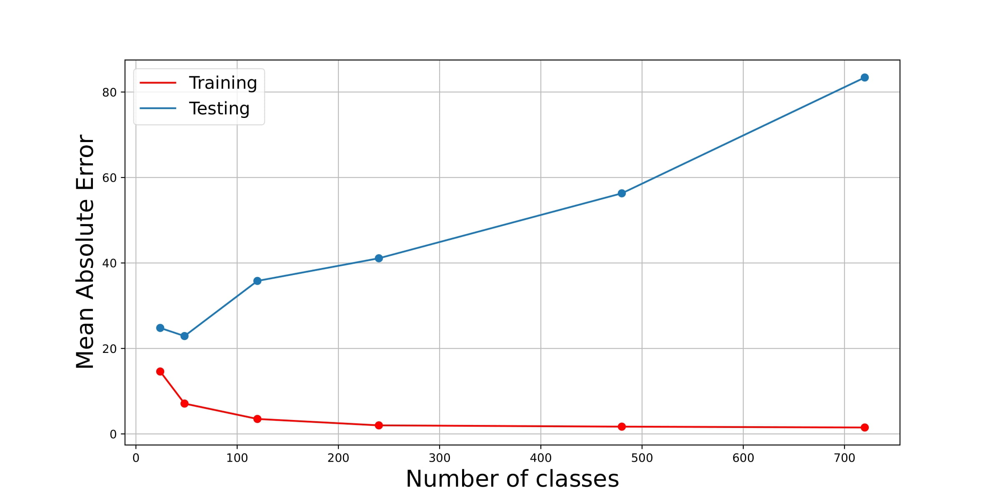
*Train and test accuracy for the classification approach with different numbers of classes*

### Generative Models - Autoencoders (VAEs) & Generative Adversarial Networks (GANs)

We implemented two generative models using TensorFlow and Keras: Variational Autoencoders (VAEs) and Generative Adversarial Networks (GANs). We used the Simpsons Faces dataset from Kaggle, which contains images of the characters from the TV show "The Simpsons".

Bellow are some examples of the generated images by the VAE and GAN models:

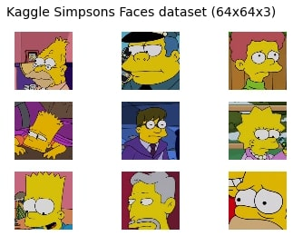 <br />
*Original images from the Simpsons Faces dataset*

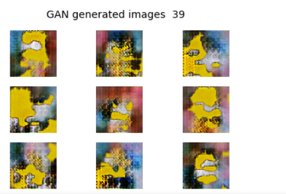 <br />
*Generated images by the GAN model*

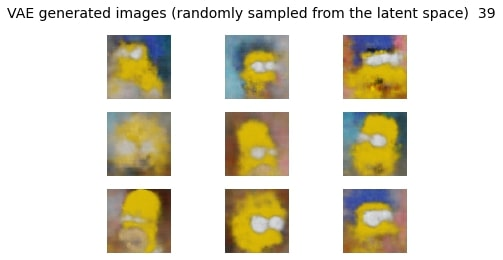 <br />
*Generated images by the VAE model*

We also generated images by interpolating between two random latent vectors in the latent space of the models. The figures below show the interpolation results for the VAE and GAN models.

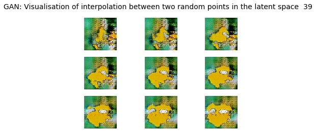 <br />
*Interpolation between two random latent vectors in the GAN model*

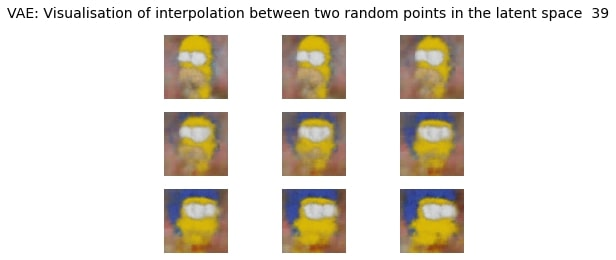 <br />
*Interpolation between two random latent vectors in the VAE model*

We can see that although not perfect, the models were able to generate images that resemble the characters from the TV show "The Simpsons". The VAE model produced more blurry images, while the GAN model produced sharper images, but with more artifacts.